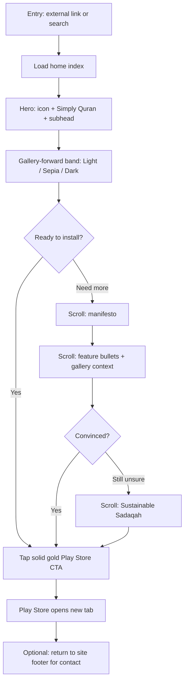
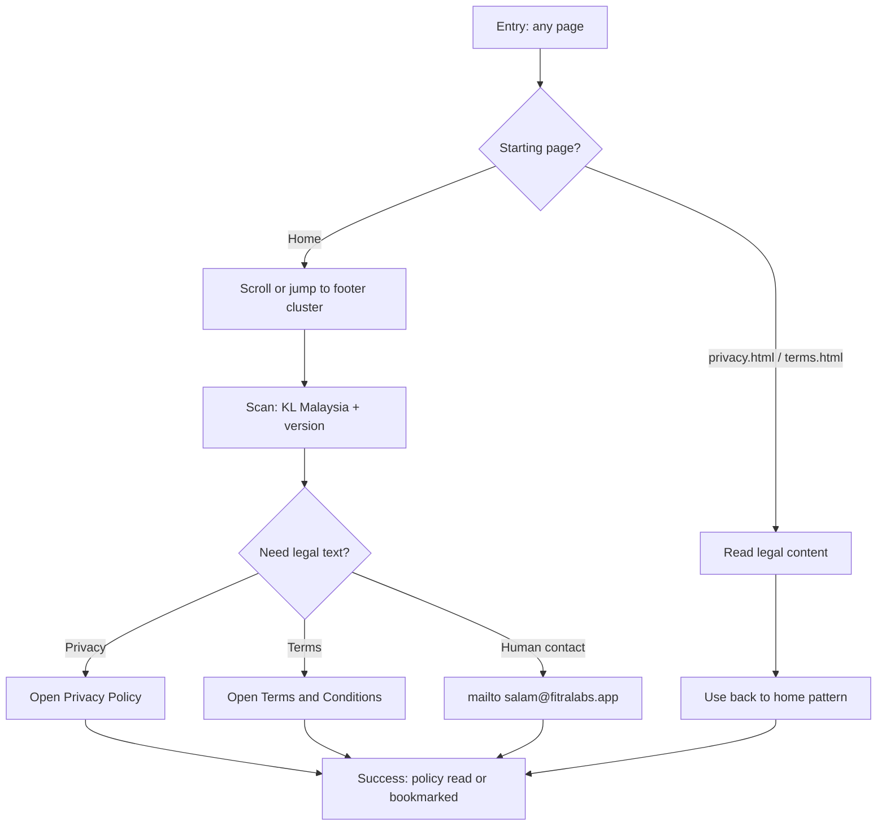
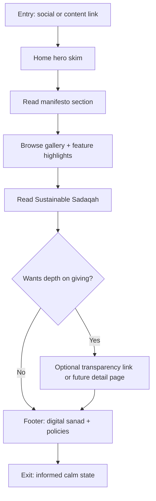

---
stepsCompleted:
  - 1
  - 2
  - 3
  - 4
  - 5
  - 6
  - 7
  - 8
  - 9
  - 10
  - 11
  - 12
  - 13
  - 14
lastStep: 14
workflowCompletedAt: "2026-04-20"
inputDocuments:
  - spec.md
---

# UX Design Specification Fitra Labs

**Author:** Arman  
**Date:** 2026-04-20

---

<!-- UX design content will be appended sequentially through collaborative workflow steps -->

## Executive Summary

### Project Vision

Fitra Labs presents itself as a boutique studio through a fast, static flagship page for Simply Quran. The experience prioritizes philosophy over feature lists: a gold-to-manuscript hero, restrained typography (Playfair Display + Inter), glass surfaces for depth without clutter, and an explicit Sustainable Sadaqah narrative so visitors feel clarity and trust. The same page must quietly satisfy **pragmatic verification needs** (clear studio name, jurisdiction, contact, and **Privacy Policy** and **Terms and Conditions** linkage) while staying editorial—not corporate. The site supports organization verification and a credible public face for fitralabs.app without sacrificing the contemplative tone.

### Target Users

**Primary:** Muslims evaluating or adopting Simply Quran—offline utility, script choice, and a calm, Mushaf-adjacent aesthetic matter more than feature lists. **Secondary:** App-store or partner **reviewers** who scan for legitimacy, contact, and policy depth in seconds. **Tertiary:** Privacy-sensitive visitors who respond to explicit no-ads, no-tracking language (while understanding normal hosting realities). Users are **mobile-first** with meaningful desktop use; some will be on **low-end devices** where glass and gradients must degrade gracefully.

### Key Design Challenges

Delivering **gold-leaf and gradient hero** treatments with a **documented contrast and fallback strategy** (solid text color, focus rings, reduced-motion paths). Using **glassmorphism** and optional **scroll-linked motion** only where they do not undermine **&lt;500ms**-class loading or **weak GPUs**. Adapting the **horizontal manuscript gallery** to narrow viewports with obvious affordance, labeling (Light / Sepia / Dark), and low-effort navigation. Expressing the **50% donation** model with **credible specificity** (what is promised on-page vs what links to deeper transparency) so it builds trust rather than skepticism. Balancing **poetic brand voice** in the footer with a **reviewer-friendly skim lane** for legal and contact facts. Keeping **Privacy** and **Terms** discoverable and scannable with **consistent** tone, update/version cues where relevant, and no dead-end legal pages on mobile.

### Design Opportunities

A **single narrative journey** (Fitra entrance → manifesto → manuscript gallery → Sadaqah → digital sanad) with optional **anchored footer** content for verification. **Manuscript-inspired** spacing and framing so the layout feels editorial. **One dominant glass CTA** (Play Store) with clear **keyboard focus** and **touch target** sizing, plus room to evolve neutral “Get the app” language if the product portfolio grows. A **transparency entry point** near Sadaqah for users who want depth without cluttering the hero. A **paired legal footer**: **Privacy Policy** + **Terms and Conditions** (same visual system, plain language summaries at top of each page if desired, then standard legal sections).

## Core User Experience

### Defining Experience

The defining experience is **confident, calm consumption of a single long-form landing narrative**, ending in a **clear primary action**: **open Simply Quran on the Play Store**. Everything else—manifesto, manuscript gallery, Sustainable Sadaqah, footer—is in service of **belief** (Fitra / quality / ethics) before that tap. A **secondary loop** is **verification and assurance**: find **contact**, **Privacy Policy**, or **Terms and Conditions** quickly without hunting.

### Platform Strategy

**Responsive web** (mobile-first, then multi-column desktop), implemented as **standard HTML5 + CSS3** only—no JS frameworks—hosted at **fitralabs.app** (e.g. static hosting). **Input modes:** touch-first, full **keyboard** and **focus** support for the glass CTA and footer links. **Site offline behavior** is not a product requirement; the page should still **paint fast** on slow networks. **Visual stack** (custom fonts, images, optional `backdrop-filter`) must stay within the **sub-500ms** performance intent from the product spec.

### Effortless Interactions

**Vertical reading** with generous whitespace so users never wonder “where next.” **One obvious primary CTA** in the hero (no competing buttons). **Gallery** that explains itself (**Light / Sepia / Dark** labels, low-effort horizontal access on small screens). **Footer** that surfaces **Privacy**, **Terms**, **contact email**, and **location/version** in a **reviewer-scannable** cluster. **Reduced motion** and **non-glass fallbacks** so the experience stays calm when effects are trimmed.

### Critical Success Moments

**First screen:** user immediately reads **Simply Quran**, the **value line**, and sees the **Play Store** path—gold/glass supports the message, it does not obscure it. **Trust flip:** the **Sustainable Sadaqah** block reads as **credible**, not promotional; optional **deeper transparency** entry works when curiosity spikes. **Reviewer moment:** within a short scroll, **policies + contact + org cues** are visible. **Failure moments:** unreadable headline on the gradient, **invisible** gallery scroll on mobile, **buried** legal links, or **heavy** assets that break the “instant” feel.

### Experience Principles

1. **Narrative before chrome** — layout and motion serve the story; nothing competes with the Mushaf metaphor or the CTA.  
2. **Trust is structural** — privacy, terms, contact, and giving claims are **first-class IA**, not footer leftovers.  
3. **Performance is a feature** — every decorative choice pays rent toward fast first paint and smooth scroll.  
4. **Accessible luxury** — premium look **with** contrast, focus, motion preferences, and text fallbacks.  
5. **One flagship** — Simply Quran owns the hero; the studio identity **frames** it without diluting it.

## Desired Emotional Response

### Primary Emotional Goals

Users should feel **calm**, **focused**, and **spiritually aligned**—as if the page honors the same discipline as opening a Mushaf. They should feel **trust** toward Fitra Labs: that the studio is **serious**, **restrained**, and **transparent** (policies, terms, contact, and giving). After the hero, they should feel **curiosity without clutter**—drawn through the manifesto and gallery toward **confidence** that Simply Quran is worth installing.

### Emotional Journey Mapping

- **Arrival (hero):** Awe-in-**stillness**—warm gold fading to manuscript white, icon and headline legible, CTA inviting rather than pushy.  
- **Middle (manifesto + gallery):** **Reflection** then **recognition** (“this is built for how I actually read”).  
- **Sadaqah block:** **Earnest hope** and **grounded generosity**—pride in supporting builders who give back, without skepticism from overselling.  
- **Footer / legal:** **Reassurance** and **respect**—everything needed for verification and peace of mind is **present and orderly**.  
- **Return visit:** **Familiar calm**—the page feels like the same trustworthy room, not a redesigned billboard.  
- **When something goes wrong** (slow network, old browser, reduced motion): **Grace**—content and meaning remain; effects step aside without shame.

### Micro-Emotions

Prioritize **trust over skepticism**, **calm over excitement**, **clarity over cleverness**, **confidence over confusion**, and **belonging (Ummah-minded)** over isolation. Avoid **anxiety** (pressure CTAs), **cynicism** (vague charity claims), **guilt**, and **cheap delight** (gimmicky motion). **Accomplishment** is subtle: “I found what I needed” more than “I beat the UI.”

### Design Implications

- **Calm** → generous margins, limited color count, predictable vertical rhythm, no surprise modals.  
- **Trust** → visible Privacy + Terms + contact; Sadaqah copy that admits limits and offers depth; typography that favors readability over ornament on body text.  
- **Reverence-adjacent dignity** → Playfair for display only where it stays readable; gold-leaf as **enhancement** with solid fallback.  
- **Focus** → single primary CTA weight; gallery labels and themes that echo Mushaf modes.  
- **Warmth without noise** → Fitra Gold as **accent**, Manuscript White as **breathing room**, Charcoal ink for **clear** reading.

### Emotional Design Principles

1. **Still water, not fireworks** — emotion emerges from **space**, **type**, and **material honesty**, not from aggressive animation or slogans.  
2. **Trust is felt before it is read** — visual order and restraint signal integrity as strongly as the words.  
3. **Sacred-adjacent sensitivity** — avoid playful or flippant patterns where the subject is Qur’anic engagement; prefer **quiet confidence**.  
4. **Generosity without performance** — Sadaqah feels **factual and humble**, not like marketing theater.  
5. **Everyone leaves steadier** — whether they install, only read, or only verify policies, they should feel **more settled** than when they arrived.

## UX Pattern Analysis & Inspiration

### Inspiring Products Analysis

**Editorial marketing sites (category: premium B2C software)**  
**What works:** One dominant hero narrative, a single primary CTA, long vertical rhythm with clear section breaks, and “proof” bands (screens, quotes, metrics) that feel **curated** rather than crowded.  
**Transferable lesson:** Treat the landing page like a **short essay** with illustrations, not a feature grid.

**Reading / knowledge apps (category: long-session reading)**  
**What works:** **Separation of display type and UI type**, generous line length limits, theme labels users already understand (light / warm / dark), and **offline-first** messaging as a trust anchor.  
**Transferable lesson:** The **manuscript gallery** should mimic how readers think about **modes**, not “skins.”

**Mission-driven commerce and giving narratives (category: ethical brands)**  
**What works:** Plain-language **impact statements**, bounded claims, and optional “learn more” depth so skeptics can self-serve without cluttering the hero.  
**Transferable lesson:** **Sustainable Sadaqah** reads best as **specific + humble**, with a path to deeper transparency.

### Transferable UX Patterns

**Navigation patterns**

- **Single-page story with anchored footer** — supports reviewer scanning and calm reading without hamburger-menu indirection.  
- **Paired legal entry** (Privacy + Terms) in the same visual cluster — supports trust and compliance paths.

**Interaction patterns**

- **Primary CTA persistence through hero** — one obvious install path; secondary actions stay textual or lower contrast.  
- **Horizontal gallery with scroll affordance** on mobile (snap, peek, labels) — supports theme comparison without a carousel UI framework.

**Visual patterns**

- **Metallic display headline + sober body** — supports “premium” without sacrificing readability when gold is dialed back.  
- **Glass panels on a soft base** — supports depth while keeping Charcoal ink text on **high-contrast** surfaces inside cards.

### Anti-Patterns to Avoid

- **Dark-patterns / fake urgency** (“Install now!!!”, countdown timers) — breaks trust and the Fitra emotional model.  
- **Stock “startup three-column feature grid”** as the main story — contradicts “philosophy over bloat.”  
- **Decorative motion** that obscures text or triggers vestibular discomfort — undermines sacred-adjacent sensitivity.  
- **Vague charity bragging** without structure for questions — invites cynicism.  
- **Legal links buried** behind icons-only or collapsed menus — fails reviewers and anxious users.

### Design Inspiration Strategy

**Adopt**

- **Editorial sectioning** and **one hero CTA** — aligns with core experience and emotional stillness.  
- **Theme-labeled manuscript captures** — aligns with reading mental models.  
- **Trust-first footer IA** (contact, Privacy, Terms, location, version) — aligns with verification and reassurance.

**Adapt**

- **Glassmorphism** from contemporary product marketing — simplify to **CSS-only**, with **solid fallbacks** and strict performance budget.  
- **Gold-leaf display treatments** from luxury branding — adapt to **accessible contrast** and **reduced-motion** behavior.

**Avoid**

- **Cookie/consent theater** if not required — conflicts with privacy story (only add what law/hosting actually demands).  
- **Heavy interactive demos** — conflicts with static HTML/CSS goals and sub-500ms intent.  
- **Multi-product parity** above the fold — conflicts with “Simply Quran as hero” until the studio grows the story deliberately.

## Design System Foundation

### 1.1 Design System Choice

**Custom token-first CSS design system** for a static multi-page site (home, Privacy, Terms, shared layout). No third-party component library; **semantic HTML5** plus **CSS custom properties** (design tokens) and a **small set of reusable pattern classes** (layout, glass surface, gold display type, prose/legal typography).

### Rationale for Selection

- **Technical constraint alignment:** The stack is **HTML + CSS only** (no JS frameworks); mainstream React/Vue design systems do not fit without changing the architecture.  
- **Brand uniqueness:** Fitra Gold, Manuscript White, Charcoal ink, Playfair display treatment, and manuscript/glass motifs are **prescriptive**—a generic system would fight the brand more than help.  
- **Performance and control:** A minimal token layer keeps **payload small**, avoids unused CSS from large libraries, and makes **sub-500ms** goals tractable.  
- **Maintenance:** With a handful of pages, **explicit patterns** (documented in this UX spec and mirrored in CSS) are easier to reason about than abstracting dozens of components you will not use.

### Implementation Approach

- **Tokens:** Centralize **color**, **spacing**, **radius**, **shadow**, **blur**, **motion duration**, **max content width**, and **focus ring** in `:root` (or a single `tokens.css`).  
- **Typography:** **Playfair Display** for display moments only; **Inter** with **system-ui** fallback and **0.05em** tracking on UI/body per brand spec.  
- **Components as patterns (not frameworks):** `.hero`, `.glass-button`, `.section`, `.gallery-track`, `.footer-cluster`, `.legal-prose`—each with **documented states** (default, `:focus-visible`, `:hover` where appropriate, `@media (prefers-reduced-motion)`).  
- **Legal parity:** Privacy and Terms share one **legal page template** (type scale, heading hierarchy, link style, back-to-home) so policies stay visually consistent with the marketing page without sharing decorative hero chrome.

### Customization Strategy

- Treat **spec.md** palette as **canonical**; extend tokens only when a new surface appears (e.g. Sadaqah band tint).  
- **Gold-leaf headline** implemented as a **progressive enhancement** (gradient text) with **solid Fitra Gold** fallback and **contrast-checked** outline/focus.  
- **Glassmorphism** gated: use **solid** panel fallback when `backdrop-filter` is unsupported or when **reduced transparency** is preferred.  
- **Evolving the system:** If the studio adds more products later, introduce a **minimal nav pattern** and additional tokens first—avoid premature “global component library” growth.

## 2. Core User Experience

### 2.1 Defining Experience

The defining experience is: **“Land in calm, understand Simply Quran in seconds, trust Fitra Labs, then leave through the right door.”**  
The **hero moment** (gold wash, icon, **Simply Quran** headline, subhead, **glass Play Store CTA**) is the signature interaction users will remember—not a novel gesture, but a **rarely executed combination** of **restraint + clarity** in a category crowded with noise. Secondary defining paths: **verify** via **Privacy / Terms / contact**, or **linger** in the **manuscript gallery** to imagine reading modes.

### 2.2 User Mental Model

Users arrive with a **skeptical-default** mental model for faith-adjacent apps and studio sites: **expect clutter, upsells, vague privacy, and tracking**. They compare this page—consciously or not—to **Play Store listings**, **other Quran apps**, and **generic “indie dev” landers**. Their expectation for “good” is **fast**, **readable**, **not salesy**, and **legit** (real contact, real policies). Confusion spikes if **the hero does not name the product**, if **the CTA is ambiguous**, or if **giving claims feel marketing-fluffy** without a path to depth.

### 2.3 Success Criteria

- **Comprehension:** Within **one viewport**, a new visitor can answer: *What is this?* (Simply Quran) *Why should I care?* (focus / soul / Mushaf) *What do I do next?* (Play Store).  
- **Trust:** **Privacy**, **Terms**, and **contact** are discoverable **without hunting** or opening mystery icons.  
- **Gallery:** A reader can **name the three modes** after a few seconds of exposure (labels + distinct captures).  
- **Sadaqah:** The block creates **earnest trust**, not **skepticism**—bounded headline claim + optional transparency entry.  
- **Performance feel:** First paint feels **immediate** on mid-tier mobile; scroll stays **smooth**; motion never blocks reading.  
- **Accessibility:** Keyboard-only users can **reach CTA and all footer links** with visible **focus**; reduced-motion users lose **decoration**, not **meaning**.

### 2.4 Novel UX Patterns

The page is **mostly established patterns**: vertical **marketing narrative**, **hero CTA**, **feature proof** via imagery, **footer legal cluster**. The **differentiation** is **editorial sequencing** and **sacred-adjacent restraint**—not a new control paradigm. **Innovation** sits in **visual craft** (gold-to-manuscript atmosphere, glass CTA, manuscript framing) and **ethical transparency** integrated into the **story**, not in a novel **interaction model** that would require teaching.

### 2.5 Experience Mechanics

**1. Initiation**  
User opens `fitralabs.app` from search, store verification flow, word-of-mouth link, or QR. **No** interstitial, **no** cookie wall unless legally required.

**2. Interaction**  
- **Primary path:** Vertical **scroll** through narrative sections; **tap** primary CTA (Play Store).  
- **Gallery path:** **Horizontal exploration** of three captures on mobile/desktop (scroll/snap; optional peek of next card).  
- **Trust path:** **Tap** Privacy, Terms, or `mailto:` from footer (and mirrored minimal header/footer on legal pages back to home).

**3. Feedback**  
- **System:** Stable **layout**, **no layout shift** from late font swap beyond acceptable bounds; **focus-visible** rings on interactive elements; **hover** states subtle on glass CTA.  
- **Content:** Section spacing and headings create a **felt rhythm** (“I am progressing through one story”).  
- **Errors / edge:** If external store link fails, user still has **contact**; legal pages always offer **plain structure** (TOC optional) for long text.

**4. Completion**  
- **Success:** User opens **Play Store listing** in a new tab (documented behavior) **or** finds **Policies + contact** for verification **or** feels **reassured** and leaves—still a success if emotional goals are met.  
- **Next:** Off-site (Play Store, email client); on-site return is **same calm page** with **version** cue in footer for “has anything changed?”

## Visual Design Foundation

### Color System

**Canonical brand colors (from product spec)**  
- **Canvas / background:** `#FAFAFA` — Manuscript White (page ground, legal pages, card interiors).  
- **Primary accent:** `#AF9058` — Fitra Gold (CTA borders, key dividers, icon strokes, display text enhancement, subtle section tints).  
- **Primary text:** `#1C1B18` — Charcoal ink (body, navigation, legal prose).

**Semantic roles (implementation-facing)**  
- **`--color-bg`** — default page background (`#FAFAFA`).  
- **`--color-bg-elevated`** — slightly lifted surfaces for cards when glass falls back (e.g. `#FFFFFF` at low opacity over canvas, or solid `#FFFFFF` if simpler).  
- **`--color-accent`** — `#AF9058` for borders, small fills, and “gold leaf” text when contrast allows.  
- **`--color-text`** — `#1C1B18` for primary reading.  
- **`--color-text-muted`** — derived muted charcoal (~70–75% contrast vs white) for captions, footer secondary lines—**still** meeting readable thresholds on `#FAFAFA`.  
- **`--color-hero-start`** — `#AF9058` (top of hero wash).  
- **`--color-hero-end`** — `#FAFAFA` (bottom blend into manuscript).  
- **`--color-sadaqah-wash`** — soft gold-tinted surface (e.g. low-opacity gold overlay on manuscript, or warm neutral band) **without** replacing Charcoal body text—headings may use accent treatment if contrast-checked.

**Glass surfaces**  
- Define **`--glass-bg`** and **`--glass-border`** as translucent neutrals + gold-tinted border; ensure **inner text** remains Charcoal on an **opaque-enough** backing for AA where text sits on glass.

**Contrast strategy**  
- **Body copy** on manuscript/white targets **WCAG AA** (normal text).  
- **Display headline** on hero: provide **gradient/metallic** as enhancement with **fallback solid** (`--color-accent` or Charcoal on light panel behind headline if needed).  
- **Links:** underline + color shift; never rely on color alone.

### Typography System

**Intent:** Classic **editorial display** + modern **UI sans**; calm, premium, readable.  
- **Display / hero:** **Playfair Display** — “Simply Quran” and major section titles where space allows.  
- **UI / body / legal:** **Inter** with **`system-ui`, `-apple-system`, `Segoe UI`, sans-serif`** fallback stack; **letter-spacing `0.05em`** on UI labels, buttons, nav, and body per brand spec.

**Type scale (starting point; tune in implementation)**  
- **Display / H1:** Playfair, largest size for hero only (fluid `clamp()`).  
- **H2 (section titles):** Playfair or Inter semibold—choose per section noise (Playfair for manifesto/gallery headings; Inter for utility headings like “Privacy” if desired).  
- **H3:** Inter semibold.  
- **Body:** Inter regular, comfortable line-height (~1.55–1.7).  
- **Caption / footer meta:** Inter, smaller size, muted token.

**Rules**  
- Avoid **all-caps** shouting; if used, track spacing modestly and keep to **small UI labels**.  
- **Legal pages:** prioritize **readability** over display flair—Inter-led hierarchy, restrained Playfair at page title only.

### Spacing & Layout Foundation

**Feel:** **Airy manuscript** — high whitespace ratio; sections breathe; gallery is the densest horizontal moment.  
- **Base unit:** **8px** grid; spacing tokens as multiples (`--space-2`…`--space-16+`).  
- **Section rhythm:** generous **vertical padding** between narrative blocks; consistent **max content width** (`clamp` + `max-width`, e.g. ~64–72rem container with inner measure for prose).  
- **Hero:** full viewport height intent with safe padding for notched devices.  
- **Gallery:** desktop **3-up** where width allows; mobile **horizontal scroll** with **peek** + **snap** + labeled frames.  
- **Footer:** structured **clusters** (studio line, legal pair, contact) with consistent inter-cluster spacing.

### Accessibility Considerations

- **Focus:** visible **`:focus-visible`** rings (gold-tinged or high-contrast) on CTA, links, and any interactive gallery controls.  
- **Motion:** respect **`prefers-reduced-motion`** — replace long fades with instant or near-instant state changes; disable non-essential parallax.  
- **Images:** meaningful **`alt`** for Simply Quran icon and each screenshot variant.  
- **Touch targets:** minimum **44×44px** hit areas for CTA and footer links on mobile.  
- **Semantics:** one **`h1`** on home; logical heading order per section; landmark regions (`header`, `main`, `footer`).  
- **Color independence:** states (hover/focus/active) use **outline/underline/shadow** in addition to color.

## Design Direction Decision

### Design Directions Explored

1. **Spec baseline** — Full-height-style **gold → manuscript** wash, **gold-leaf** headline treatment, **glass** CTA, gallery on neutral band. Closest to original `spec.md` hero description.  
2. **Softer hero wash** — Shorter / gentler gradient; more **Manuscript White** early; lower drama.  
3. **Panel headline (readability-first)** — Headline on a **light panel** over a soft wash; strongest **WCAG margin** for metallic display type.  
4. **Gallery-forward** — **Flat manuscript** hero; **solid gold** CTA; elevates proof/screens earlier—more **product-forward**, still calm.  
5. **Minimal line luxe** — **Paper field** + **gold hairline**; gold mostly as **border** and CTA ring; maximum editorial restraint.  
6. **Sadaqah-forward atmosphere** — Richer gold in hero + **gold-dust gallery band**; bolder emotional warmth (watch contrast).

### Chosen Direction

**Direction 4 — Gallery-forward** (stakeholder selection). Hero sits primarily on **Manuscript White** with restrained gold accents; **Simply Quran** headline in **Charcoal ink** (or controlled dark) for maximum clarity; **primary CTA** uses **solid Fitra Gold** fill (high confidence, tactile “button”) rather than glass as the default. The **manuscript screenshot gallery** sits **immediately adjacent** to the hero band (visually continuous or lightly separated) so **proof of reading modes** is part of the first impression, not a late reward for scrolling.

**Relationship to other directions:** Direction **3** (headline panel) remains a **fallback pattern** if display headline contrast needs tightening on specific devices. Direction **1** wash can be reintroduced **below** the fold (e.g. manifesto or Sadaqah) if the studio wants more gold atmosphere without losing gallery-forward clarity.

### Design Rationale

Gallery-forward aligns with users who **compare apps visually** and with **reviewers** who want **immediate substance**. Solid gold CTA improves **legibility and affordance** on pale backgrounds and reduces reliance on `backdrop-filter` for the most critical conversion control. The approach still honors **Fitra Gold / Manuscript White / Charcoal** and **Inter + Playfair**—it shifts **emphasis**, not palette.

### Implementation Approach

- Implement **hero + gallery** as one **visual “proof band”** on desktop (stacked on mobile: hero block then horizontal gallery).  
- Default CTA: **solid** gold with Charcoal or near-white label text per contrast check; optional **glass** variant only for secondary actions if needed.  
- Use **Playfair** for hero product name if contrast allows; otherwise **Inter semibold** for hero H1 and reserve Playfair for section titles—validate in implementation.  
- Keep **`ux-design-directions.html`** as the **reference artifact** for Direction 4; production markup/CSS lives in the site repo.

## User Journey Flows

### Journey A — “Install Simply Quran” (primary conversion)

**Goal:** User understands the product in one screenful, glances at **manuscript modes**, and opens the **Play Store** with confidence.  
**Entry:** Organic search, word-of-mouth URL, QR, or “website” link from store listing.  
**Success:** Play Store opens (new tab); user can return to site.  
**Friction to avoid:** Ambiguous CTA, gallery feels decorative without labels, gold-on-gold weak text.

### Journey B — “Verify the studio” (reviewer / due diligence)

**Goal:** Find **who**, **where**, **how to contact**, and **policies** quickly—often without caring about the hero story.  
**Entry:** Direct footer anchor, second visit, or scroll-to-bottom habit.  
**Success:** Opens **Privacy** or **Terms**, or sends **email** to `salam@fitralabs.app`.

### Journey C — “Understand Fitra, no install yet” (consideration)

**Goal:** User leaves **more settled**—philosophy + ethics understood—even if they do not install today.  
**Entry:** Curious reader from social post or blog.  
**Success:** Completes manifesto + Sadaqah sections with **clear mental model** (no ads/track, 50% model bounded).

### Journey Patterns

- **Single-page narrative spine** on home; **legal pages** as **parallel exits** with shared template.  
- **Progressive disclosure:** hero proves product visually; **manifesto** carries philosophy; **Sadaqah** carries ethics depth.  
- **Consistent footer cluster** as the **global trust port** on all pages.  
- **External handoff** (Play Store, mailto) always explicit; no fake in-site “install”.

### Flow Optimization Principles

- **Minimize steps to Play Store** for Journey A: **CTA visible** in hero; gallery supports decision without extra clicks.  
- **Zero mystery icons** for legal or contact—**text links** with generous hit targets.  
- **Reduce cognitive load:** one primary CTA style (solid gold per Direction 4); secondaries stay textual.  
- **Error resilience:** if outbound link blocked, user still reaches **mailto** and policies from footer.  
- **Respect attention:** no interstitials; optional motion stays **non-blocking**.

## Component Strategy

### Design System Components

From the **custom token foundation** (Step 6), the reusable **primitives** are not React components but **design tokens and base elements**:

- **Tokens:** color, spacing, radius, shadow, blur, motion, focus ring, max width, muted text.  
- **Base HTML:** headings, paragraphs, lists, links, `header` / `main` / `footer`, `nav` (minimal), `figure` / `figcaption` for gallery.  
- **Global behaviors:** link underline style, `:focus-visible`, `prefers-reduced-motion`, font loading fallbacks.

These cover **typography**, **color**, and **layout rhythm**—everything else is a **composed pattern** below.

### Custom Components

#### ProofHeroBand

**Purpose:** Deliver **Direction 4**—product identity + **immediate manuscript proof** in one vertical band (desktop can read as one continuous “proof strip”).  
**Usage:** Top of `index.html` only.  
**Anatomy:** optional minimal wordmark row → **icon** → **H1** → subhead → **SolidPrimaryCTA** → **ManuscriptGalleryTrack** (adjacent or stacked by breakpoint).  
**States:** default; reduced hero padding on short viewports; ensure no overlap with notches (safe-area padding).  
**Variants:** mobile **stack** (hero block then gallery); desktop **tight coupling** (gallery visible without scroll where possible).  
**Accessibility:** one `h1`; icon has meaningful `alt`; gallery each has `alt` + visible label.  
**Content guidelines:** Subhead stays a single sentence; CTA label exactly “Download on Play Store” (or final store copy).  
**Interaction:** CTA `target="_blank"` `rel="noopener"`; gallery horizontally scrollable on narrow screens.

#### SolidPrimaryCTA

**Purpose:** Highest-confidence **install** action (Direction 4 default).  
**Usage:** Hero primary; avoid duplicating above the fold.  
**Anatomy:** pill button, solid `#AF9058` fill, label with contrast-checked text color.  
**States:** default, `:hover`, `:active`, `:focus-visible` (ring), `disabled` (not used unless link invalid).  
**Variants:** none preferred; optional **small** variant for future secondary placements.  
**Accessibility:** `a` element with explicit accessible name; min **44×44px** touch target.

#### ManuscriptGalleryTrack

**Purpose:** Show **Light / Sepia / Dark** as tangible proof.  
**Usage:** Immediately under hero in Direction 4.  
**Anatomy:** horizontal track containing **ManuscriptCaptureCard** items.  
**States:** default scroll; optional scroll-snap; keyboard focusable items if captures are interactive (prefer static images with text labels unless opening lightbox).  
**Variants:** 3-up desktop; horizontal scroll mobile.  
**Accessibility:** list semantics or `figure` per item; visible text labels; do not rely on color alone to distinguish themes.

#### ManuscriptCaptureCard

**Purpose:** One themed screenshot frame.  
**Usage:** Inside gallery track.  
**Anatomy:** image + caption label (Light / Sepia / Dark).  
**States:** default; `prefers-reduced-motion` disables hover zoom if any.  
**Variants:** fixed aspect ratio for consistency.  
**Accessibility:** `alt` describes UI mode, not generic “screenshot”.

#### SectionShell

**Purpose:** Consistent vertical section padding and max-width for manifesto, features, Sadaqah.  
**Usage:** All narrative sections below proof band.  
**Anatomy:** section heading + content container.  
**States:** default.  
**Variants:** “prose wide” vs “narrow manifesto column.”

#### ManifestoProse

**Purpose:** High-whitespace philosophical copy block.  
**Usage:** Manifesto section.  
**Anatomy:** optional small label + paragraph(s).  
**Accessibility:** `h2` for section; paragraph line length capped.

#### SadaqahBand

**Purpose:** Explain **50%** model with gravity; optional link to deeper transparency.  
**Usage:** Dedicated band with gold-tint background per visual foundation.  
**States:** default; link hover/focus.  
**Accessibility:** readable text on tinted surface; `h2`/`h3` hierarchy consistent.

#### FooterTrustCluster

**Purpose:** Journey B **trust port**—location, version, Privacy, Terms, contact.  
**Usage:** Footer on all pages.  
**Anatomy:** “Handcrafted…” line → link row → version.  
**States:** link hover/focus.  
**Accessibility:** `nav` with `aria-label` “Legal and contact”; list of links.

#### LegalPageChrome

**Purpose:** Shared frame for **Privacy** and **Terms**—fast scan, return home.  
**Usage:** `privacy.html`, `terms.html`.  
**Anatomy:** site title link home + `h1` page title + `main` prose container + FooterTrustCluster.  
**States:** default.  
**Accessibility:** skip link optional; heading hierarchy `h1` then `h2` sections inside policy.

### Component Implementation Strategy

- Implement as **semantic HTML** + **CSS classes** colocated by page (`styles.css`) with optional partials only if the build process allows—**no framework components**.  
- **Compose** all marketing sections from **SectionShell** + inner content components.  
- **Share** `FooterTrustCluster` and **LegalPageChrome** markup via copy-paste snippet or static include strategy consistent with repo conventions (SSI, build step, or duplicate minimal block—document choice at build time).  
- **Validate** each pattern against **tokens** only (no magic hex outside exceptions documented in tokens file).

### Implementation Roadmap

**Phase 1 — Core paths (Journeys A & B)**  
- `ProofHeroBand`, `SolidPrimaryCTA`, `ManuscriptGalleryTrack`, `ManuscriptCaptureCard`, `FooterTrustCluster`, `LegalPageChrome` skeleton + tokens.

**Phase 2 — Narrative depth (Journey C)**  
- `SectionShell`, `ManifestoProse`, feature list styling, `SadaqahBand` + optional transparency link styling.

**Phase 3 — Polish & hardening**  
- Motion/fade-in spec aligned with `prefers-reduced-motion`, contrast pass on hero/gallery, image optimization, final copy lock for Terms parity with footer IA.

## UX Consistency Patterns

### Button Hierarchy

**When to use**  
- **Primary:** one **SolidPrimaryCTA** for the **Play Store** install path in the proof band.  
- **Secondary:** inline **text links** (underline on hover/focus) for optional transparency, “Learn more,” or future lightweight actions.  
- **Tertiary:** footer/legal links as **text** in the trust cluster—never compete visually with the primary CTA.

**Visual design**  
- Primary: solid **Fitra Gold** fill, pill shape, **high-contrast** label.  
- Secondary/tertiary: **Charcoal ink** (or token link color) on **Manuscript White**; no second “button-shaped” control above the fold.

**Behavior**  
- Primary opens **new tab** with `rel="noopener"`.  
- Secondary links navigate in **same tab** unless explicitly external.

**Accessibility**  
- Visible **`:focus-visible`** ring on all actionable controls.  
- Minimum **44×44px** hit area for primary CTA and footer links on touch devices.

**Mobile**  
- Primary CTA remains **full-width max** (`max-width` constrained) where thumbs reach; avoid sticky bars that obscure manuscript content unless added later with strong justification.

### Feedback Patterns

**When to use**  
This release has **no client-side form submission** and no authenticated flows—feedback is mostly **implicit** (navigation, scroll position, successful external handoff).

**Visual / behavior**  
- **Success:** user lands on expected destination (Play Store / mail client / policy page).  
- **System limitations:** avoid **blocking spinners** for static assets; prefer **fast assets** and reserved image dimensions to prevent CLS.  
- **Errors:** if an external link is misconfigured, **footer contact** remains the recovery path—no error toast library required.

**Accessibility**  
- For rare inline notices (future), prefer **live region** only when dynamic content is introduced—**not** needed for v1 static pages.

**Mobile**  
Same as desktop: **no modal error UX** planned for v1.

### Form Patterns

**When to use**  
**v1.0.0:** **No on-site forms** (no newsletter, no contact form). Contact is **`mailto:salam@fitralabs.app`**.

**If a form is added later**  
- Use **label + input** pairs, server-side validation story, and explicit **privacy** placement near submit—out of scope for current static charter.

**Accessibility**  
N/A for v1 beyond ensuring **mailto** link text is descriptive (“Email Fitra Labs” optional variant).

### Navigation Patterns

**When to use**  
- **Home:** single-page scroll narrative; optional **skip to main content** link if header grows.  
- **Cross-page:** `privacy.html`, `terms.html` use **LegalPageChrome** with **home** link in header/title.  
- **In-page:** avoid auto hijacking scroll; if anchor links are added, ensure **focus management** policy is documented (prefer simple anchors without JS).

**Visual design**  
- Minimal top chrome; **footer trust cluster** is the stable navigation surface for policies.

**Accessibility**  
- `nav` for footer link groups with `aria-label`.  
- Current page indication on legal pages optional (`aria-current="page"` on disabled crumb if nav expands).

**Mobile**  
- Footer links remain **vertical stack** or **wrapped row** with adequate spacing—no icon-only footer.

### Additional Patterns

**External links**  
- Play Store: `target="_blank"` + `rel="noopener noreferrer"` (policy-consistent).  
- `mailto:`: same tab behavior default.

**Imagery**  
- **Figures** with captions for gallery; consistent **aspect ratio** containers.

**Motion**  
- Subtle **fade-in** only where CSS allows; always gated by **`prefers-reduced-motion`**.

**Content tone in UI chrome**  
- Buttons and links use **plain, honest verbs**—no urgency language, no dark patterns.

## Responsive Design & Accessibility

### Responsive Strategy

**Mobile-first (primary)**  
- **ProofHeroBand** stacks: icon → headline → subhead → **SolidPrimaryCTA** → **ManuscriptGalleryTrack** (horizontal scroll with peek/snap).  
- **Typography** uses fluid `clamp()` for hero display; body line length capped via `max-width` on prose blocks.  
- **Touch:** primary CTA and footer links meet **44×44px** minimum; gallery scroll does not hijack vertical page scroll.

**Tablet**  
- Intermediate widths may show **2-up + partial third** in gallery or transition early to **3-up** depending on art direction; maintain **same narrative order** as mobile.

**Desktop**  
- Use extra width for **comfortable outer margins** and optional **3-up gallery** without increasing cognitive density (no extra nav chrome).  
- **Multi-column** only where it **reduces scroll fatigue** for non-hero sections if ever introduced (v1 remains mostly single column below the fold per spec intent).

### Breakpoint Strategy

**Approach:** Mobile-first CSS with **`min-width` media queries**.  
**Default tokens (tune during implementation):**

- **Base / small:** 0–**639px** — stacked proof band; gallery horizontal scroll.  
- **Medium:** **640px+** — gallery may switch to multi-column or larger cards; increase section horizontal padding.  
- **Large:** **1024px+** — max-width container centered; **3-up** gallery if assets support; more air around manifesto.  
- **XL:** **1280px+** — optional increase in container max-width only if line length stays within readable bounds.

**Custom tuning:** Validate against **real device** widths (e.g. 390×844, 360×800, 1280×720) rather than only breakpoints on paper.

### Accessibility Strategy

**Target:** **WCAG 2.2 Level AA** for substantive text and interactive components on default themes.  
**Color:** Body **Charcoal on Manuscript White** meets contrast expectations; **muted** text must be verified against `#FAFAFA`. **Solid gold CTA** label color must meet **4.5:1** (or **3:1** if large text only—prefer treating CTA text as normal size for strictness).  
**Keyboard:** Full tab order through CTA, in-page anchors (if any), and footer links; **visible focus** on all.  
**Screen readers:** Semantic landmarks (`header`, `main`, `footer`), one `h1` on home, descending headings; `alt` text for icon and screenshots; `nav` labels for footer link groups.  
**Motion:** Respect **`prefers-reduced-motion`**; disable or shorten decorative fades.  
**Skip link:** Recommended if header gains height: “Skip to main content.”

### Testing Strategy

**Responsive**  
- Physical or browserstack-style checks on **iOS Safari**, **Chrome Android**, **desktop** Chrome/Edge/Firefox/Safari.  
- **CLS:** reserve image dimensions for gallery and icon.  
- **Network:** slow 3G spot-check for hero image weight.

**Accessibility**  
- **Automated:** axe or Lighthouse accessibility pass on `index`, `privacy`, `terms`.  
- **Manual:** full **keyboard-only** walk; **VoiceOver** (iOS/macOS) and **NVDA** (Windows) smoke on hero + footer + one legal page.  
- **Zoom:** 200% text zoom without loss of content or overlapping controls.

### Implementation Guidelines

**Responsive**  
- Prefer **`rem`** for type/spacing, **`%` / `fr`** for grid, **`clamp()`** for hero sizing; avoid fixed-height heroes that clip localized text.  
- **`env(safe-area-inset-*)`** padding on full-bleed sections where needed.

**Accessibility**  
- Semantic HTML first; **ARIA** only to patch gaps.  
- **`focus-visible`** styles must not be removed for “aesthetics.”  
- **External links:** communicate “opens external site” in visible text or **accessible name** if policy requires (align with copy decisions).

**Performance ties to a11y**  
- Fast load reduces **assistive tech** friction on low-end devices; keep critical CSS and font subsets disciplined.
